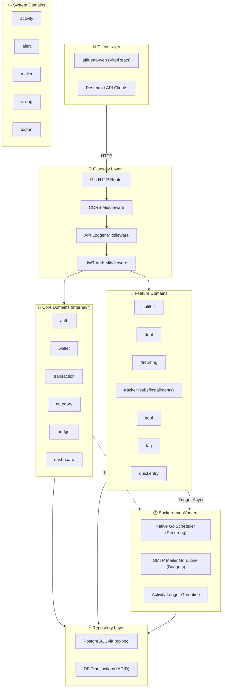

# Affluena-API: System Map

> **Versi:** v2.1 (Ultimate Edition) — 14 Juni 2026  
> **Status:** Production-Ready Backend API  
> **Stack:** Go 1.26 · Gin · PostgreSQL 17 (pgx v5) · Docker Compose · Native JWT · Native Scheduler

---

## 1. Arsitektur Tingkat Tinggi (High-Level Architecture)

---

## 2. Struktur Database (Entity-Relationship)

Sistem ini terdiri dari **20 tabel PostgreSQL** yang dirancang untuk kecepatan transaksi dan perlindungan data yang ketat (isolasi multi-tenant melalui `user_id`).

### Tabel Utama (Core Engine)
1. **`users`**: Entitas utama pengguna. Menyimpan email, hash password (bcrypt), dan preferensi mata uang default.
2. **`refresh_tokens`**: Manajemen sesi login (refresh & revoke mechanism).
3. **`wallets`**: Representasi dompet keuangan (`cash`, `bank`, `e_wallet`, `investment`, `goal`).
4. **`wallet_shares`**: Tabel pivot M:M untuk menghubungkan dompet utama dengan pengguna lain (Shared Wallets).
5. **`categories`**: Kategori pencatatan finansial (`income` dan `expense`), mendukung sistem hirarki (Sub-kategori) melalui `parent_id`.
6. **`transactions`**: Engine mutasi saldo paling penting. Menyimpan mutasi (`income`, `expense`, `transfer`, `adjustment`). Setiap modifikasi tabel ini dijalankan dengan mekanisme ACID.

### Tabel Ekstensi (Wealth & Financial Features)
7. **`category_budgets`**: Limit pengeluaran dinamis per bulan untuk sebuah kategori tertentu.
8. **`debts`**: Pelacak instrumen hutang dan piutang.
9. **`debt_payments`**: Riwayat angsuran/cicilan hutang yang terintegrasi langsung dengan tabel `transactions`.
10. **`installments`**: Pelacak cicilan (e.g. KPR, Cicilan Mobil) yang mencatat sisa tenor bulanan.
11. **`subscriptions`**: Pelacak tagihan langganan (e.g. Spotify, Netflix) dengan dukungan pencatatan detail akun (`account_detail`).
12. **`recurring_transaction_rules`**: Blueprint eksekusi untuk transaksi berulang (mingguan/bulanan).
13. **`recurring_transaction_runs`**: Log historis eksekusi cron job agar transaksi tidak tertagih ganda.
14. **`goals`**: Target tabungan finansial, lengkap dengan status (`active`, `achieved`) dan batas waktu pencapaian (`deadline`).
15. **`goal_members`**: Dukungan partisipasi komunal (Shared Goals).
16. **`tags`**: Basis data entitas tag (Contoh: `#LiburanBali`).
17. **`transaction_tags`**: Tabel Pivot M:M yang menghubungkan transaksi dengan `tags`.
18. **`quick_entry_templates`**: Preset cetakan transaksi (misal: "Beli Kopi") yang bisa diklik untuk mencatat dalam hitungan detik.

### Tabel Observabilitas (System Telemetry)
19. **`api_logs`**: Menyimpan riwayat setiap request HTTP API (lengkap dengan Payload Request & Response) untuk *audit trail* keamanan.
20. **`user_activities`**: *Audit log* aktivitas pengguna di level aplikasi.

---

## 3. Direktori Package Backend (`internal/`)
Aplikasi ini dipecah ke dalam **24 package terisolasi** menggunakan arsitektur Modular Monolith:

| Package | Tanggung Jawab (Domain) |
|---|---|
| `activity` | Mencatat riwayat log tindakan user (Audit Trail) |
| `alert` | Mengecek ambang batas budget dan *trigger* peringatan |
| `apilog` | Middleware untuk memantau request HTTP dan latency |
| `auth` | Proses registrasi, otentikasi JWT, login, logout |
| `budget` | Pengaturan *Category Budgets* bulanan |
| `caldate` | Utility format tanggal dan waktu |
| `category` | CRUD untuk tipe `income` dan `expense` |
| `config` | Manajemen *Environment Variable* |
| `dashboard` | Agregasi data (Summary, Cashflow Trend, Forecast) |
| `db` | Konektor ke PostgreSQL (menggunakan pgxpool) |
| `debt` | Logika manajemen hutang dan pelunasan cicilannya |
| `export` | Generator dokumen (contoh: Export CSV) |
| `goal` | Manajemen tabungan (bersama & pribadi) |
| `httpx` | Utility standar untuk response JSON dan error HTTP |
| `mailer` | Infrastruktur SMTP untuk kirim email |
| `page` | Helper standar untuk *Pagination* |
| `quickentry`| Manajemen template pencatatan cepat |
| `recurring` | Aturan transaksi periodik & *Native Scheduler Engine* |
| `server` | *Router builder* (Gin) dan injeksi dependensi silang |
| `splitbill` | Algoritma pemecah transaksi makro menjadi mutasi mikro & hutang |
| `tag` | CRUD tag transaksi komprehensif |
| `tracker` | Manajemen *Subscriptions* dan *Installments* |
| `transaction`| Jantung utama aplikasi. Logika ACID mutasi dompet |
| `wallet` | Manajemen dompet dan saldo pengguna |

---

## 4. Daftar Lengkap Endpoint API (Total: 74 Endpoints)
Semua rute berjalan dengan *prefix* `/api/v1/`.

### 🛡️ Publik (Tanpa Token)
- `GET /healthz` - Health Check Container
- `POST /auth/register` - Pendaftaran pengguna
- `POST /auth/login` - Otentikasi (mengembalikan Access/Refresh token)
- `POST /auth/refresh` - Pertukaran *Refresh Token*

### 🔒 Terproteksi (Bearer Token Wajib)
**Auth & Users**
- `GET /auth/me` - Ambil profil diri
- `POST /auth/logout` - Logout (revocation)
- `GET /activities` - Daftar riwayat aktivitas akun

**Dashboard & Analytics**
- `GET /dashboard/summary` - Metrik dasar dompet & pengeluaran
- `GET /dashboard/cashflow-trend` - Analitik cashflow historis
- `GET /dashboard/expense-distribution` - Distribusi uang per kategori
- `GET /dashboard/forecast` - Prediksi keuangan di masa depan
- `GET /export/csv` - Unduh laporan transaksi utuh

**Wallets**
- `GET /wallets`
- `POST /wallets`
- `GET /wallets/:id`
- `PUT /wallets/:id`
- `DELETE /wallets/:id`
- `POST /wallets/:id/invites` - Undang user lain
- `PATCH /wallets/:id/members/:member_id` - Respon undangan kolaborasi

**Categories & Tags**
- `GET /categories` | `POST /categories` | `GET /categories/:id` | `PUT /categories/:id` | `DELETE /categories/:id`
- `GET /tags` | `POST /tags` | `GET /tags/:id` | `PUT /tags/:id` | `DELETE /tags/:id`

**Transactions & Split Bill**
- `GET /transactions` - Menampilkan *timeline* finansial (dukung *pagination* & *filtering*)
- `POST /transactions` - *Atomic mutation* (mengubah dompet)
- `GET /transactions/:id`
- `PUT /transactions/:id` - Re-balance transaksi
- `DELETE /transactions/:id` - *Rollback* saldo
- `POST /transactions/split` - **Algoritma Canggih:** Membelah tagihan makan malam teman menjadi pengeluaran pribadi dan sistem hutang secara otomatis.

**Budgets & Financial Trackers**
- `GET /category-budgets` | `POST /category-budgets` | `GET /category-budgets/:id` | `PUT /category-budgets/:id` | `DELETE /category-budgets/:id`
- `GET /installments` | `POST /installments` | `GET /installments/:id` | `PUT /installments/:id` | `DELETE /installments/:id`
- `POST /installments/:id/pay` - Bayar bulanan cicilan
- `GET /subscriptions` | `POST /subscriptions` | `GET /subscriptions/:id` | `PUT /subscriptions/:id` | `DELETE /subscriptions/:id`
- `POST /subscriptions/:id/pay` - Eksekusi bayar langganan

**Debts & Loans**
- `GET /debts` | `POST /debts` | `GET /debts/:id` | `PUT /debts/:id` | `DELETE /debts/:id`
- `POST /debts/:id/pay` - Angsuran pembayaran hutang/piutang

**Goals (Tabungan)**
- `GET /goals` | `POST /goals` | `GET /goals/:id`
- `POST /goals/:id/members` - Undang patungan
- `PUT /goals/:id/members/:user_id/respond`

**Automation**
- `GET /quick-entry-templates` | `POST /quick-entry-templates` | `GET /quick-entry-templates/:id` | `PUT /quick-entry-templates/:id` | `DELETE /quick-entry-templates/:id`
- `POST /quick-entry-templates/:id/execute` - *One-click save*
- `GET /recurring-transactions` | `POST /recurring-transactions` | `GET /recurring-transactions/:id` | `PUT /recurring-transactions/:id` | `DELETE /recurring-transactions/:id`
- `POST /recurring-transactions/:id/run` - Paksa eksekusi *cron* manual

---

## 5. Standard Operation Procedure & Guardrails
Aplikasi ini diamankan dengan 3 aturan keras:

1. **Transaction Integrity Guard:**
   Setiap mutasi wajib dijalankan dalam lingkup blok `tx, err := pgxpool.Begin()`. Jika API gagal merekam kategori pengeluaran, saldo dompet wajib kembali ke asal (*rollback*). Ini divalidasi oleh `make verify` setiap ada perubahan.

2. **Async Goroutine Boundaries:**
   Tugas berat seperti pengecekan `alert` peringatan budget >80% dan pencatatan audit API tidak boleh memakan siklus respons HTTP. API merespons klien di bawah <100ms, sementara Goroutine background berjalan hingga selesai.

3. **Multi-Tenant Protection:**
   Setiap kueri SQL dan operasi `repository` **wajib** menggunakan parameter `user_id`. Segala macam celah kebocoran ID lintas pengguna (IDOR) akan membatalkan *build*.
