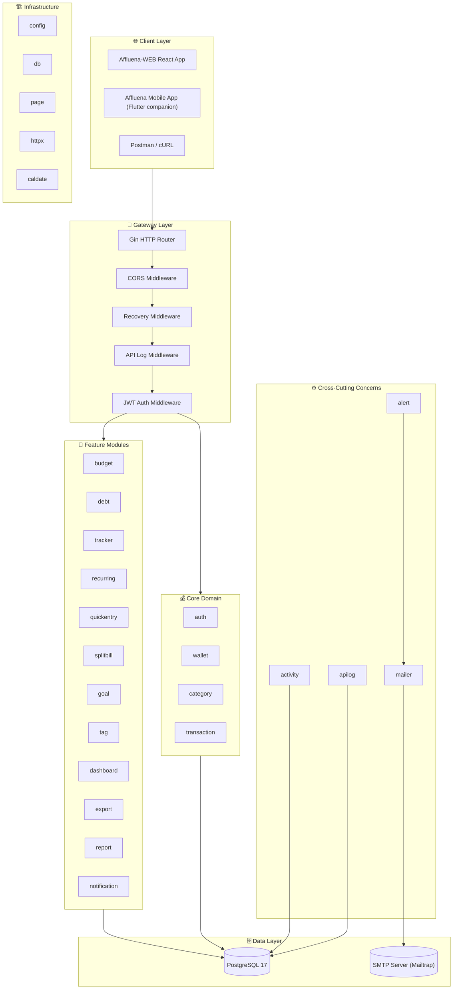
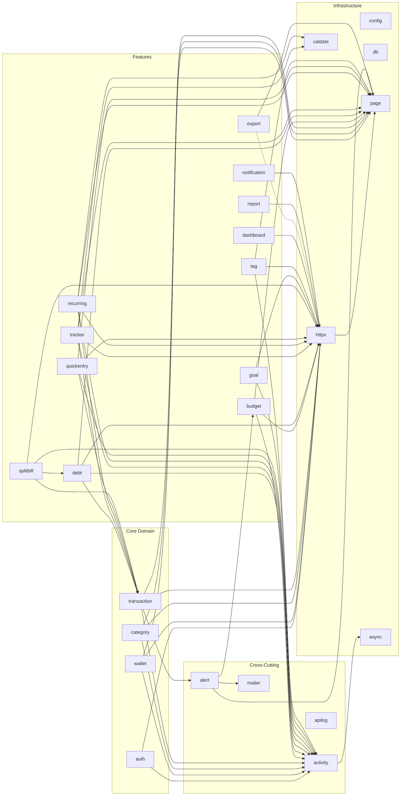
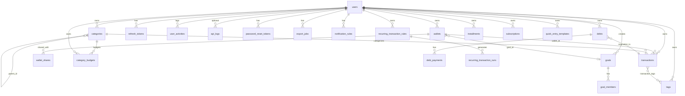
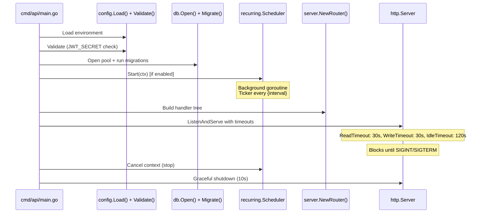

# Affluena-API: System Map

> **Versi:** v2.8 — 24 Juni 2026
> **Go Files:** 172 total (105 source + 67 test) | **Source Code:** ~13.640 baris | **Test Code:** ~10.540 baris
> **Stack:** Go 1.26 · Gin · PostgreSQL 17 (pgx v5) · Docker Compose · Native JWT · Native Scheduler

---

## 1. Arsitektur Tingkat Tinggi (High-Level Architecture)



**Client consumer note:** API ini adalah kontrak bersama untuk web dashboard dan Flutter mobile companion. Web tetap cocok untuk dashboard besar, audit, report, export, dan admin-like workflows. Mobile companion diposisikan untuk daily flows: login/session, dashboard ringkas, quick entry, transaksi, wallets, categories, notification rules, dan profile/security.

---

## 2. Peta Modul (27 Paket Internal)

> Tabel di bawah merinci **26 paket domain/infrastruktur**. Paket ke-27 adalah `internal/server` — composition root (dependency injection + route registration di `router.go`) sekaligus rumah seluruh integration test; pola dan isinya dijelaskan di [§8 Pola Arsitektur Per-Modul](#8-pola-arsitektur-per-modul) dan [§9 Testing Map](#9-testing-map).

### 2.1. Infrastruktur & Utilitas

| Modul | Lokasi | Deskripsi | Dependensi |
|-------|--------|-----------|------------|
| **config** | `internal/config/` | Membaca environment variables dengan fallback defaults dan validasi. 18 parameter konfigurasi. Validasi JWT_SECRET (min 32 chars). Fail-fast pada startup. | stdlib |
| **db** | `internal/db/` | Koneksi pool PostgreSQL (`pgxpool`) dan sistem migrasi file-based (25 file SQL). | pgx |
| **page** | `internal/page/` | Struct generik `Result[T]` untuk pagination (`limit`, `offset`, `total`). | stdlib |
| **httpx** | `internal/httpx/` | Helper HTTP: `MustUserID`, `GetUUIDParam`, `ParsePage`, `BindOptionalJSON`, `WriteError` (error mapping), `Error`, `JSON`, `InternalError`, `PublicError`, `RateLimiter` (auth/API rate limiting). | page, gin, golang.org/x/time/rate |
| **caldate** | `internal/caldate/` | Fungsi `AddMonthsClamped` — menambah bulan dengan clamping hari ke akhir bulan target. | stdlib |
| **async** | `internal/async/` | Helper `SafeGo` untuk menjalankan goroutine dengan panic recovery. | stdlib |

### 2.2. Core Domain

| Modul | Lokasi | File | Lines | Deskripsi |
|-------|--------|------|-------|-----------|
| **auth** | `internal/auth/` | 6 src + 2 test | 870 + 287 | Registrasi, login, refresh token (JWT HS256 + bcrypt), forgot/reset password, profile, password change, dan session revocation. Token rotation otomatis. Atomic refresh token consume (UPDATE...RETURNING) mencegah race condition. |
| **wallet** | `internal/wallet/` | 5 src + 2 test | 918 + 313 | Multi-dompet (cash/bank/e_wallet/investment/goal). Sharing antar user. Access control: `AccessLevel`, `CheckOwnerAccess`, `CheckMemberAccess`, dan `AccessChecker` untuk shared-wallet-aware checks. |
| **category** | `internal/category/` | 4 src + 1 test | 489 + 267 | Hierarki hingga 3 level. Validasi: same-user, same-type, no cycle. |
| **transaction** | `internal/transaction/` | 5 src + 3 test | 982 + 376 | CRUD transaksi (income/expense/transfer/adjustment). Saldo wallet diubah secara atomik. Hanya creator yang boleh edit/delete transaksi. Category/tag adalah metadata personal pembuat. |

### 2.3. Feature Modules

| Modul | Lokasi | File | Lines | Deskripsi |
|-------|--------|------|-------|-----------|
| **budget** | `internal/budget/` | 5 src + 2 test | 783 + 227 | Limit pengeluaran per kategori per bulan. Recursive CTE untuk hierarki. Alerts dan report membaca kategori turunan. |
| **debt** | `internal/debt/` | 5 src + 3 test | 954 + 500 | Hutang-piutang (payable/receivable) dengan disbursement & payment otomatis. Delete adalah soft-cancel (status → cancelled) untuk audit trail. |
| **tracker** | `internal/tracker/` | 7 src + 2 test | 1226 + 387 | Cicilan (installment) & langganan (subscription). Status transitions, `account_detail`, dan shared-wallet payments. |
| **recurring** | `internal/recurring/` | 6 src + 2 test | 993 + 253 | Transaksi berulang via native Go scheduler (weekly/monthly). `SKIP LOCKED`, idempotency run rows, manual run endpoint. |
| **quickentry** | `internal/quickentry/` | 4 src + 1 test | 555 + 209 | Template transaksi instan satu-klik. Execute = buat transaksi sungguhan. |
| **splitbill** | `internal/splitbill/` | 3 src + 1 test | 219 + 108 | Macro endpoint — 1 request = 1 expense + N piutang (receivable debts). Mendukung full split (total split == amount) dan partial split. |
| **goal** | `internal/goal/` | 4 src + 1 test | 576 + 153 | Target tabungan kolaboratif. Invite member → auto-create goal wallet. |
| **tag** | `internal/tag/` | 4 src | 341 | Label lintas-kategori (Many-to-Many dengan transactions). |
| **dashboard** | `internal/dashboard/` | 5 src | 613 | Summary, Cashflow Trend, Expense Distribution, Spend Forecast. |
| **export** | `internal/export/` | 4 src | 432 | Ekspor transaksi ke CSV dan audit `export_jobs`. |
| **report** | `internal/report/` | 4 src + 2 test | 779 + 129 | Laporan income, expense, cashflow, debt, goal, dan overview. |
| **notification** | `internal/notification/` | 4 src + 2 test | 230 + 197 | Preferensi notification rules per user (`budget-alert`, `due-reminder`, `recurring-run`, `security-alert`, `weekly-summary`). |

### 2.4. Cross-Cutting Concerns

| Modul | Lokasi | File | Lines | Deskripsi |
|-------|--------|------|-------|-----------|
| **activity** | `internal/activity/` | 4 src + 1 test | 357 + 202 | Audit trail aktivitas user. Fire-and-forget goroutine (5s timeout). Description truncation (500 char), deduplication (5-min window). |
| **apilog** | `internal/apilog/` | 4 src + 1 test | 434 + 239 | Middleware pencatatan HTTP request/response ke DB. Masking auth payload, sensitive field redaction, 32KB payload limit, skip response logging untuk export endpoints. |
| **alert** | `internal/alert/` | 6 src + 2 test | 579 + 378 | Budget alert feed dan email threshold (≥80%/≥100%). Deduplication via `sent_alerts` table prevents duplicate notifications. |
| **mailer** | `internal/mailer/` | 1 src | 61 | Interface `Mailer` + implementasi `SMTPMailer` (net/smtp). |

---

## 3. Dependency Graph (Antar-Modul)



---

## 4. Skema Database (24 Tabel)



### 4.1. Daftar Tabel & Kolom Kunci

| # | Tabel | Kolom Kunci | Constraint Penting |
|---|-------|-------------|-------------------|
| 1 | `users` | id (UUID PK), email (UNIQUE), password_hash | — |
| 2 | `refresh_tokens` | id, user_id (FK), token_hash (UNIQUE), expires_at, revoked_at | CASCADE on user delete |
| 3 | `wallets` | id, user_id (FK), name, type, currency_code, balance_minor, goal_id | UNIQUE(user_id, name), CHECK type ∈ {cash,bank,e_wallet,investment,goal} |
| 4 | `wallet_shares` | wallet_id (FK), user_id (FK), status | PK(wallet_id, user_id), CHECK status ∈ {pending,joined,rejected} |
| 5 | `categories` | id, user_id (FK), name, type, parent_id (self-FK) | UNIQUE(user_id, name, type), CHECK type ∈ {income,expense}, max depth 3 |
| 6 | `transactions` | id, user_id (FK), type, wallet_id (FK), to_wallet_id, category_id, amount_minor, transaction_at, note | CHECK type rules, CHECK amount ≠ 0 |
| 7 | `transaction_tags` | user_id, transaction_id (FK), tag_id (FK) | PK(transaction_id, tag_id), composite FK ownership |
| 8 | `tags` | id, user_id (FK), name | UNIQUE(user_id, name) |
| 9 | `quick_entry_templates` | id, user_id, name, type, wallet_id, category_id, amount_minor | UNIQUE(user_id, name) |
| 10 | `category_budgets` | id, user_id, category_id, month, limit_minor | UNIQUE(user_id, category_id, month), CHECK limit > 0 |
| 11 | `installments` | id, user_id, name, wallet_id, category_id, total/monthly/tenor/remaining, status | CHECK remaining ≤ tenor, CHECK status ∈ {active,paid_off,cancelled} |
| 12 | `subscriptions` | id, user_id, name, wallet_id, category_id, amount_minor, billing_cycle, next_due_date, status, account_detail | CHECK status ∈ {active,paused,cancelled} |
| 13 | `recurring_transaction_rules` | id, user_id, name, type, wallet_id, frequency, interval_count, next_run_at, end_at, status | Partial index on active+due, CHECK status ∈ {active,paused,cancelled} |
| 14 | `recurring_transaction_runs` | id, rule_id, user_id, scheduled_for, transaction_id, run_type | UNIQUE(rule_id, scheduled_for) — idempotency guard |
| 15 | `debts` | id, user_id, type, counterparty_name, wallet_id, principal/paid_amount_minor, status | CHECK paid ≤ principal, CHECK type ∈ {receivable,payable}, CHECK status ∈ {open,partial,paid_off,cancelled} |
| 16 | `debt_payments` | id, user_id, debt_id, transaction_id, amount_minor, paid_at | CASCADE on debt delete |
| 17 | `goals` | id, user_id, name, target_amount_minor, deadline, status | CHECK target > 0, CHECK status ∈ {active,achieved,cancelled} |
| 18 | `goal_members` | goal_id, user_id, status | PK(goal_id, user_id), CHECK status ∈ {pending,joined,rejected} |
| 19 | `api_logs` | id, method, path, status_code, latency_ms, client_ip, user_agent, user_id, request_payload, response_payload | Index on created_at |
| 20 | `user_activities` | id, user_id, action_type, entity_type, entity_id, description | Index on (user_id, created_at DESC) |
| 21 | `sent_alerts` | user_id, category_id, month_value, alert_type, sent_at | PK(user_id, category_id, month_value, alert_type) — prevents duplicate alerts |
| 22 | `password_reset_tokens` | id, user_id, token_hash, expires_at, used_at | Password reset lifecycle |
| 23 | `export_jobs` | id, user_id, format, from_at, to_at, row_count, status, created_at | CSV export audit trail |
| 24 | `notification_rules` | id, user_id, rule_key, title, enabled, channel | UNIQUE(user_id, rule_key), CHECK channel in email/in-app/both |

### 4.2. Migrasi (25 File)

| File | Deskripsi |
|------|-----------|
| `000001_init.sql` | Core tables: users, refresh_tokens, wallets, categories, transactions, quick_entry_templates |
| `000002_budget_installment_subscription.sql` | category_budgets, installments, subscriptions |
| `000003_recurring_transactions.sql` | recurring_transaction_rules, recurring_transaction_runs |
| `000004_debts.sql` | debts, debt_payments |
| `000005_user_owned_foreign_keys.sql` | Composite FK enforcement (user_id, resource_id) |
| `000006_subscription_account_detail.sql` | Adds account_detail to subscriptions |
| `000007_financial_goals.sql` | goals, goal_members, wallet type 'goal' |
| `000008_tags.sql` | tags, transaction_tags |
| `000009_category_hierarchy.sql` | Adds parent_id to categories |
| `000010_transaction_tag_ownership.sql` | Composite FK for tag ownership |
| `000011_category_parent_ownership.sql` | Same-user same-type parent enforcement |
| `000012_wallet_shares.sql` | wallet_shares table, drops strict wallet FK |
| `000013_api_logs.sql` | api_logs table |
| `000014_api_logs_payloads.sql` | Adds request/response payload columns |
| `000015_user_activities.sql` | user_activities table |
| `000016_wallet_share_quick_entry_templates.sql` | Shared wallet support for templates |
| `000017_wallet_share_recurring_rules.sql` | Shared wallet support for recurring rules |
| `000018_wallet_share_trackers.sql` | Shared wallet support for trackers |
| `000019_wallet_share_debts.sql` | Shared wallet support for debts |
| `000020_sent_alerts.sql` | sent_alerts table for budget alert deduplication |
| `000021_wallet_color_description.sql` | Adds wallet color and description fields |
| `000022_user_profile.sql` | Adds account profile fields |
| `000023_password_reset_tokens.sql` | Password reset token storage |
| `000024_export_jobs.sql` | Export job audit table |
| `000025_notification_rules.sql` | User notification rule preferences |

### 4.3. Scripts (Development)

| File | Deskripsi |
|------|-----------|
| `cmd/seed` | Seeder Go idempotent untuk demo user `demo@affluena.com`, fixed UUID demo wallets/categories/tags, transaksi, budget, debt, subscription, installment, recurring rule, goal, dan quick entry template. |
| `scripts/seed.sql` | Seeder SQL dummy data komprehensif untuk testing frontend/manual DB fixture. |
| `scripts/verify.sh` | Full verification gate yang dipanggil oleh `make verify`. |

---

## 5. API Route Map (100 Registered Routes)

### 5.1. Public Routes (6)

| Method | Path | Handler | Deskripsi |
|--------|------|---------|-----------|
| GET | `/healthz` | inline | Health check |
| POST | `/api/v1/auth/register` | auth.Register | Registrasi user baru |
| POST | `/api/v1/auth/login` | auth.Login | Login & dapatkan token |
| POST | `/api/v1/auth/refresh` | auth.Refresh | Refresh access token |
| POST | `/api/v1/auth/forgot-password` | auth.ForgotPassword | Request password reset |
| POST | `/api/v1/auth/reset-password` | auth.ResetPassword | Complete password reset |

### 5.2. Protected Routes (94) — Semua membutuhkan `Authorization: Bearer <token>`

#### Auth & Profile
| Method | Path | Handler |
|--------|------|---------|
| GET | `/api/v1/auth/me` | auth.Me |
| PUT | `/api/v1/auth/account` | auth.UpdateAccount |
| PUT | `/api/v1/auth/password` | auth.ChangePassword |
| GET | `/api/v1/auth/sessions` | auth.ListSessions |
| DELETE | `/api/v1/auth/sessions/:session_id` | auth.RevokeSession |

#### Dashboard & Analytics
| Method | Path | Handler |
|--------|------|---------|
| GET | `/api/v1/dashboard/summary` | dashboard.Summary |
| GET | `/api/v1/dashboard/cashflow-trend` | dashboard.CashflowTrend |
| GET | `/api/v1/dashboard/expense-distribution` | dashboard.ExpenseDistribution |
| GET | `/api/v1/dashboard/forecast` | dashboard.Forecast |

#### Wallets (CRUD + Sharing)
| Method | Path | Handler |
|--------|------|---------|
| POST | `/api/v1/wallets` | wallet.Create |
| GET | `/api/v1/wallets` | wallet.List |
| GET | `/api/v1/wallets/:id` | wallet.Get |
| PUT | `/api/v1/wallets/:id` | wallet.Update |
| DELETE | `/api/v1/wallets/:id` | wallet.Delete |
| POST | `/api/v1/wallets/:id/invites` | wallet.InviteMember |
| PATCH | `/api/v1/wallets/:id/members/:member_id` | wallet.RespondInvite |
| GET | `/api/v1/wallets/:id/members` | wallet.ListMembers |
| GET | `/api/v1/wallets/:id/analytics` | wallet.Analytics |

#### Categories (CRUD + Hierarchy)
| Method | Path | Handler |
|--------|------|---------|
| POST | `/api/v1/categories` | category.Create |
| GET | `/api/v1/categories` | category.List |
| GET | `/api/v1/categories/:id` | category.Get |
| PUT | `/api/v1/categories/:id` | category.Update |
| DELETE | `/api/v1/categories/:id` | category.Delete |

#### Tags (CRUD)
| Method | Path | Handler |
|--------|------|---------|
| POST | `/api/v1/tags` | tag.Create |
| GET | `/api/v1/tags` | tag.List |
| GET | `/api/v1/tags/:id` | tag.Get |
| PUT | `/api/v1/tags/:id` | tag.Update |
| DELETE | `/api/v1/tags/:id` | tag.Delete |

#### Transactions (CRUD + Split Bill)
| Method | Path | Handler |
|--------|------|---------|
| POST | `/api/v1/transactions/split` | splitbill.Split |
| POST | `/api/v1/transactions` | transaction.Create |
| GET | `/api/v1/transactions` | transaction.List |
| GET | `/api/v1/transactions/:id` | transaction.Get |
| PUT | `/api/v1/transactions/:id` | transaction.Update |
| DELETE | `/api/v1/transactions/:id` | transaction.Delete |

#### Quick Entry Templates (CRUD + Execute)
| Method | Path | Handler |
|--------|------|---------|
| POST | `/api/v1/quick-entry-templates` | quickentry.Create |
| GET | `/api/v1/quick-entry-templates` | quickentry.List |
| GET | `/api/v1/quick-entry-templates/:id` | quickentry.Get |
| PUT | `/api/v1/quick-entry-templates/:id` | quickentry.Update |
| DELETE | `/api/v1/quick-entry-templates/:id` | quickentry.Delete |
| POST | `/api/v1/quick-entry-templates/:id/execute` | quickentry.Execute |

#### Category Budgets (CRUD)
| Method | Path | Handler |
|--------|------|---------|
| POST | `/api/v1/category-budgets` | budget.Create |
| GET | `/api/v1/category-budgets` | budget.List |
| GET | `/api/v1/category-budgets/alerts` | budget.Alerts |
| GET | `/api/v1/category-budgets/report` | budget.Report |
| GET | `/api/v1/category-budgets/:id` | budget.Get |
| PUT | `/api/v1/category-budgets/:id` | budget.Update |
| DELETE | `/api/v1/category-budgets/:id` | budget.Delete |

#### Debts (CRUD + Pay)
| Method | Path | Handler |
|--------|------|---------|
| POST | `/api/v1/debts` | debt.Create |
| GET | `/api/v1/debts` | debt.List |
| GET | `/api/v1/debts/:id` | debt.Get |
| PUT | `/api/v1/debts/:id` | debt.Update |
| DELETE | `/api/v1/debts/:id` | debt.Delete |
| POST | `/api/v1/debts/:id/pay` | debt.Pay |

#### Goals (Create + Invite + Respond)
| Method | Path | Handler |
|--------|------|---------|
| POST | `/api/v1/goals` | goal.Create |
| GET | `/api/v1/goals` | goal.List |
| GET | `/api/v1/goals/:id` | goal.Get |
| PUT | `/api/v1/goals/:id` | goal.Update |
| POST | `/api/v1/goals/:id/members` | goal.InviteMember |
| PUT | `/api/v1/goals/:id/members/:user_id/respond` | goal.RespondInvite |

#### Installments (CRUD + Pay)
| Method | Path | Handler |
|--------|------|---------|
| POST | `/api/v1/installments` | tracker.CreateInstallment |
| GET | `/api/v1/installments` | tracker.ListInstallments |
| GET | `/api/v1/installments/:id` | tracker.GetInstallment |
| PUT | `/api/v1/installments/:id` | tracker.UpdateInstallment |
| DELETE | `/api/v1/installments/:id` | tracker.DeleteInstallment |
| POST | `/api/v1/installments/:id/pay` | tracker.PayInstallment |

#### Subscriptions (CRUD + Pay)
| Method | Path | Handler |
|--------|------|---------|
| POST | `/api/v1/subscriptions` | tracker.CreateSubscription |
| GET | `/api/v1/subscriptions` | tracker.ListSubscriptions |
| GET | `/api/v1/subscriptions/:id` | tracker.GetSubscription |
| PUT | `/api/v1/subscriptions/:id` | tracker.UpdateSubscription |
| DELETE | `/api/v1/subscriptions/:id` | tracker.DeleteSubscription |
| POST | `/api/v1/subscriptions/:id/pay` | tracker.PaySubscription |

#### Recurring Transactions (CRUD + Manual Run)
| Method | Path | Handler |
|--------|------|---------|
| POST | `/api/v1/recurring-transactions` | recurring.Create |
| GET | `/api/v1/recurring-transactions` | recurring.List |
| GET | `/api/v1/recurring-transactions/:id` | recurring.Get |
| PUT | `/api/v1/recurring-transactions/:id` | recurring.Update |
| DELETE | `/api/v1/recurring-transactions/:id` | recurring.Delete |
| POST | `/api/v1/recurring-transactions/:id/run` | recurring.RunManual |

#### Reports, Export, Activities, Logs, Alerts, Notifications
| Method | Path | Handler |
|--------|------|---------|
| GET | `/api/v1/reports/income` | report.Income |
| GET | `/api/v1/reports/expense` | report.Expense |
| GET | `/api/v1/reports/cashflow` | report.Cashflow |
| GET | `/api/v1/reports/debt` | report.Debt |
| GET | `/api/v1/reports/goal` | report.Goal |
| GET | `/api/v1/reports/overview` | report.Overview |
| GET | `/api/v1/export/csv` | export.ExportCSV |
| GET | `/api/v1/export/jobs` | export.ListJobs |
| GET | `/api/v1/export/jobs/:id` | export.GetJob |
| GET | `/api/v1/activities` | activity.ListActivities |
| GET | `/api/v1/activities/:id` | activity.GetActivity |
| GET | `/api/v1/system-logs` | apilog.List |
| GET | `/api/v1/system-logs/:id` | apilog.GetLog |
| GET | `/api/v1/alerts` | alert.List |
| GET | `/api/v1/alerts/:id` | alert.Get |
| GET | `/api/v1/notifications/rules` | notification.List |
| PUT | `/api/v1/notifications/rules/:id` | notification.Update |

---

## 6. Alur Bisnis Kritis (Critical Business Flows)

### 6.1. Balance Delta — Bagaimana Transaksi Mengubah Saldo

```
┌─────────────────────────────────────────────────────────┐
│ BalanceDeltas(input TransactionInput) → []BalanceDelta  │
├───────────┬──────────────────┬──────────────────────────┤
│ Type      │ wallet_id        │ to_wallet_id             │
├───────────┼──────────────────┼──────────────────────────┤
│ income    │ +amount_minor    │ N/A                      │
│ expense   │ -amount_minor    │ N/A                      │
│ transfer  │ -amount_minor    │ +amount_minor            │
│ adjustment│ +amount_minor*   │ N/A  (*bisa negatif)     │
└───────────┴──────────────────┴──────────────────────────┘
```

Pada **Update**: old deltas di-reverse dulu, baru new deltas di-apply.  
Pada **Delete**: old deltas di-reverse.  
Semuanya dalam satu PostgreSQL `BEGIN...COMMIT`.

### 6.2. Debt Payment Flow

```
Receivable (Piutang):
  Origination → expense (uang keluar, kamu pinjamkan)
  Payment     → income  (uang kembali, mereka bayar)

Payable (Hutang):
  Origination → income  (uang masuk, kamu pinjam)
  Payment     → expense (uang keluar, kamu bayar balik)

Status: open → partial → paid_off (otomatis saat paid == principal)
```

### 6.3. Split Bill Flow

```
POST /api/v1/transactions/split
  │
  ├─ 1. Validasi: sum(splits) <= total_amount (over-split ditolak; full split sum == total valid)
  ├─ 2. BEGIN TX
  │     ├─ Buat 1x Expense transaction senilai total_amount (user bayar penuh di depan)
  │     └─ Buat Nx Debt(receivable) per split participant
  └─ 3. COMMIT
```

### 6.4. Recurring Scheduler Flow

```
main.go → recurring.Scheduler.Start(ctx)
  │
  └─ Setiap {interval} (default 1m):
       └─ RunDue(ctx, now, batchSize)
            └─ Loop up to batchSize:
                 ├─ SELECT ... FOR UPDATE SKIP LOCKED (1 active rule)
                 ├─ INSERT INTO runs ON CONFLICT DO NOTHING (idempotency)
                 ├─ CreateInTx (buat transaksi)
                 ├─ Advance next_run_at
                 └─ Auto-cancel if next_run > end_at
```

### 6.5. Budget Alert Flow

```
transaction.Create (Expense)
  │
  └─ go alertUC.CheckBudgetAndAlert(ctx, userID, categoryID)
       ├─ List budgets for month
       ├─ Find matching category budget
       ├─ ratio = spent / limit
       ├─ TryInsertSentAlert for atomic deduplication (user_id, category_id, month, alert_type)
       ├─ if exist → skip
       ├─ if ratio ≥ 0.8 → WARNING email
       ├─ if ratio ≥ 1.0 → EXCEEDED email
       ├─ mailer.SendEmail(SMTP) → Mailtrap
       └─ Mark alert as sent in sent_alerts table
```

---

## 7. Middleware Pipeline

```
Request ──► gin.Recovery() ──► CORS ──► apilog.APILogMiddleware ──► [RateLimiter] ──► [auth.AuthMiddleware] ──► Handler
                                         │                                      │                           │
                                         │                              /auth/* only                │
                                         │                      (AuthLimiter: 5 req/s)       │
                                         │                                                      │
                                         ▼                                                      ▼
                                   Catat ke DB                                    Validate JWT
                                   - Method, Path, Status                              - Extract userID
                                   - Latency (ms)                                       - Set context
                                   - Client IP, User Agent
                                   - Request & Response Body
                                   - Masking pada /auth/*
```

---

## 8. Pola Arsitektur Per-Modul

Setiap modul domain mengikuti pola konsisten:

```
internal/<domain>/
  ├── domain.go        → Struct, tipe, konstanta, sentinel error
  ├── handler.go       → HTTP handler (Gin), request binding, response
  ├── usecase.go       → Business logic, validasi, orkestrasi
  ├── repository.go    → Query PostgreSQL (pgx), DB transaction
  ├── service.go       → Pure functions (BalanceDeltas, ApplyPayment, dsb)
  └── *_test.go        → Unit test (mock-based)

internal/server/
  ├── router.go              → Dependency injection & route registration
  └── *_integration_test.go  → Integration test (real DB via Docker)
```

**Prinsip:**
- **Handler** hanya menangani HTTP (bind, respond, error mapping)
- **UseCase** menangani business logic (validasi, orchestration)
- **Repository** menangani persistence (SQL, DB transactions)
- **Service** berisi pure functions tanpa side-effect (testable tanpa mock)

---

## 9. Testing Map

### 9.1. Automated Tests (67 test files, 213 `Test*` functions)

| Modul | File Test | Lines | Fokus |
|-------|-----------|-------|-------|
| activity | usecase_test.go | 202 | Goroutine safety, EntityID copy |
| alert | feed_usecase_test.go, usecase_test.go | 378 | Alert feed, threshold 80%/100%, mock mailer, sent alert dedup |
| apilog | middleware_test.go | 239 | Masking, health check skip, payload capture |
| async | async_test.go | 39 | SafeGo panic recovery |
| auth | middleware_test.go, service_test.go | 287 | JWT validation, registration, login, profile/session flows |
| budget | service_test.go, usecase_test.go | 227 | UsageSummary calc, month parsing, budget report |
| caldate | month_test.go | 33 | Clamping (Jan 31→Feb 28) |
| category | usecase_test.go | 267 | Hierarchy depth, cycle detection |
| config | config_test.go | 108 | Env var parsing, defaults, validation |
| db | migration_integration_test.go | 367 | Migration constraints and DB invariants |
| debt | repository_integration_test.go, service_test.go, usecase_test.go | 500 | ApplyPayment, ResolveStatus, overpayment, repository lifecycle |
| goal | usecase_test.go | 153 | Create, invite, respond |
| httpx | context_test.go, param_test.go, request_test.go, response_test.go, ratelimit_test.go | 371 | UserID context, bind, error mapping, UUID validation, rate limiting |
| notification | handler_test.go, usecase_test.go | 197 | Rule list/update, defaults, channel validation |
| quickentry | usecase_test.go | 209 | Template validation, execute |
| recurring | service_test.go, usecase_test.go | 253 | AdvanceNextRunAt, NextState |
| report | handler_test.go, usecase_test.go | 129 | Report handlers and month-scoped aggregation behavior |
| splitbill | usecase_test.go | 108 | Split validation and participant share behavior |
| tracker | service_test.go, usecase_test.go | 387 | Installment plan validation, payment |
| transaction | service_test.go, usecase_test.go, test_helpers_test.go | 376 | BalanceDeltas, all 4 types |
| wallet | access_test.go, usecase_test.go | 313 | CRUD, type validation, access helper behavior |

### 9.2. Integration Tests (31 server files; 73 DB/server/debt `Test*` functions run by `make verify`)

The table below highlights high-value integration coverage. It is representative, not a complete inventory of every current test file.

| File | Test Function(s) | Skenario Kunci |
|------|-------------------|----------------|
| financial_flow_integration_test.go | TestTransactionLifecycleMaintainsWalletBalances | CRUD transaksi → saldo wallet konsisten |
| isolation_integration_test.go | TestUsersCannotReadOrMutateEachOthersWalletsCategoriesAndTransactions | Isolasi data antar user |
| splitbill_integration_test.go | TestSplitBillIntegration, TestSplitBillRollsBackAllWritesWhenDebtCreationFails | Split bill + atomicity |
| wallet_share_integration_test.go | 3 tests | Shared wallet lifecycle, former member protection |
| tag_integration_test.go | 4 tests | Tag CRUD, cross-user rejection, deduplication |
| goal_integration_test.go | 2 tests | Goal lifecycle, duplicate names, invite edge cases |
| category_hierarchy_test.go | 2 tests | Parent nesting, cross-user/type mismatch |
| dashboard_integration_test.go | 3 tests | Analytics, forecast, edge cases |
| apilog_integration_test.go | 3 tests | Log saving, health check skip, auth masking |
| recurring_integration_test.go | 1 test | Manual run → transaction + wallet update |
| pagination_integration_test.go | 1 test | Pagination metadata, sorting |
| export_integration_test.go | 2 tests | CSV export, invalid date rejection |
| activity_integration_test.go | 1 test | Pagination, sorting, user isolation |

---

## 10. Verification Gate (`make verify`)

```
make verify
  └── scripts/verify.sh
       ├── 1. gofmt check        → Semua file Go harus formatted
       ├── 2. go test ./...      → Unit tests (semua modul)
       ├── 3. go vet ./...       → Static analysis
       ├── 4. go build           → Compile binary
       ├── 5. python3 json.tool  → Validasi Postman JSON
       ├── 6. docker compose up  → Rebuild + start containers
       ├── 7. Integration tests  → Test terhadap real PostgreSQL
       └── 8. Health check       → GET /healthz → {"status":"ok"}
```

---

## 11. Konfigurasi & Environment

| Variable | Default | Deskripsi |
|----------|---------|-----------|
| `APP_ENV` | development | Mode aplikasi |
| `HTTP_ADDR` | :8080 | Port HTTP |
| `DATABASE_URL` | postgres://...localhost | Connection string PostgreSQL |
| `JWT_SECRET` | **wajib di production** | Secret untuk JWT HS256 (min 32 karakter, divalidasi saat startup) |
| `ACCESS_TOKEN_TTL` | 15m | Masa berlaku access token |
| `REFRESH_TOKEN_TTL` | 720h (30 hari) | Masa berlaku refresh token |
| `RUN_MIGRATIONS` | true | Auto-run migration saat startup |
| `RECURRING_SCHEDULER_ENABLED` | true | Aktifkan background scheduler |
| `RECURRING_SCHEDULER_INTERVAL` | 1m | Interval pengecekan scheduler |
| `RECURRING_SCHEDULER_BATCH_SIZE` | 20 | Max rules per tick |
| `CORS_ALLOWED_ORIGINS` | http://localhost:5173 | Allowed CORS origins (comma-separated) |
| `SMTP_HOST` | sandbox.smtp.mailtrap.io | SMTP server host |
| `SMTP_PORT` | 2525 | SMTP server port |
| `SMTP_USER` | (kosong) | SMTP username |
| `SMTP_PASS` | (kosong) | SMTP password |
| `SMTP_FROM` | noreply@affluena.com | Alamat pengirim email |
| `AUTH_RATE_LIMIT_RPS` | 5 | Rate limit auth endpoint (request per detik) |
| `AUTH_RATE_LIMIT_BURST` | 10 | Burst size rate limit auth endpoint |

---

## 12. External Dependencies

| Package | Versi | Fungsi |
|---------|-------|--------|
| `github.com/gin-gonic/gin` | v1.12.0 | HTTP web framework |
| `github.com/jackc/pgx/v5` | v5.10.0 | PostgreSQL driver + connection pool |
| `github.com/golang-jwt/jwt/v5` | v5.3.1 | JWT token creation & validation |
| `golang.org/x/crypto` | v0.53.0 | bcrypt password hashing |
| `github.com/stretchr/testify` | v1.11.1 | Test assertions |
| `github.com/google/uuid` | v1.6.0 | UUID validation |
| `github.com/cespare/xxhash/v2` | v2.3.0 | Fast hash for deduplication |
| `golang.org/x/time/rate` | v0.15.0 | Rate limiting |

---

## 13. Startup Sequence



---

## 14. Guardrails & Aturan Pengembangan

> [!IMPORTANT]
> Aturan berikut **WAJIB** dipatuhi oleh setiap kontributor (manusia maupun AI agent):

1. **Isolasi User** — Setiap resource yang dimiliki user harus di-scope via `user_id`. User A TIDAK BOLEH mengakses data User B.
2. **Konsistensi Saldo** — Setiap operasi yang melibatkan uang harus menggunakan PostgreSQL Transaction (BEGIN/COMMIT). Saldo wallet harus selalu akurat.
3. **Pagination Seragam** — Semua endpoint list mengembalikan `{collection, pagination}` dengan `limit/offset/sort`. _Pengecualian:_ `GET /api/v1/goals` mengembalikan JSON array polos tanpa metadata pagination (lihat `internal/goal/handler.go`); kedua client (WEB & MOBILE) sudah menangani bentuk ini secara khusus.
4. **Testing Wajib** — Setiap perubahan business logic harus disertai unit test + integration test. `make verify` harus lolos sebelum commit.
5. **Conventional Commits** — Format: `feat:`, `fix:`, `docs:`, `test:`, `refactor:`.
6. **Monetary Values** — Disimpan sebagai `int64` minor units (misal: Rp 50.000 = `50000`).
7. **Auth Masking** — Payload auth (password, token) HARUS di-mask di API logs.
8. **Error Sanitization** — Error internal (5xx) tidak boleh diekspos langsung ke client. Gunakan `httpx.WriteError()`, `httpx.PublicError`, atau helper yang tersedia.
9. **Config Validation** — `JWT_SECRET` wajib di-set di production (min 32 karakter). Aplikasi fail-fast jika config invalid.
10. **Refresh Token Atomic** — Refresh token consumption harus atomic (UPDATE...RETURNING) untuk mencegah race condition.
11. **Transaction Ownership** — Hanya creator transaksi yang boleh mengubah (update/delete) transaksinya sendiri. User lain dengan akses shared wallet hanya bisa view.
12. **UUID Path Parameters** — Gunakan `httpx.GetUUIDParam()` untuk validasi UUID dari path parameters. Menulis 400 error otomatis jika format invalid.
13. **Rate Limiting** — Endpoint auth (`/auth/*`) dilindungi oleh `AuthLimiter` (5 req/s, burst 10). Gunakan `APILimiter` untuk endpoint lain jika diperlukan.
14. **Shared API Contract** — Jangan membuat kontrak endpoint khusus web atau khusus mobile tanpa kebutuhan nyata. Web React dan Flutter companion harus memakai `/api/v1` contract yang sama agar behavior, pagination, auth, dan error handling tetap konsisten.

---

## 15. Roadmap & Pending Features

Fitur berikut masih dalam status pengembangan atau tertunda (*pending*):

1. **Due Date Reminders** — *Background scheduler* harian untuk memeriksa `subscriptions` dan `installments` yang aktif, lalu mengirimkan email pengingat (via `mailer` module) tepat **H-3** sebelum jatuh tempo.
2. **Flutter Mobile Companion** — First-class mobile consumer untuk daily flows. Prioritas API usage: auth/session, dashboard summary, quick entry, wallets, categories, transactions, notification rules, profile/password, dan eventually push/biometric-adjacent session policy. Jangan tambah endpoint mobile-specific sebelum ada gap kontrak yang terbukti dari app flow.
